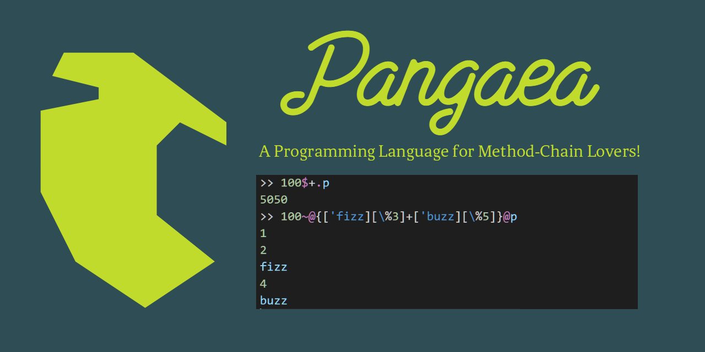

# Pangaea programming language
[](LICENSE)

[](https://codecov.io/gh/Syuparn/Pangaea)
[](https://syuparn.github.io/Pangaea/)
[](./docs/reference/README.md)
[](https://github.com/Syuparn/Pangaea/releases)



# How to run

## Download Binary

See [Releases](https://github.com/Syuparn/Pangaea/releases).

## Or Build Manially

```bash:
$ git clone https://github.com/Syuparn/Pangaea.git
$ cd ./Pangaea
$ go generate
$ go build
```

## Or Use Pangaea Playground

Visit https://syuparn.github.io/Pangaea/ !

## Run

```bash
# Run REPL
# (Linux, Mac)
$ ./pangaea
# (Windows)
$ ./pangaea.exe

# Run script file
# (Linux, Mac)
$ ./pangaea ./example/hello.pangaea
# (Windows)
$ ./pangaea.exe ./example/hello.pangaea

# Enjoy!
```

## What can I do?
[Examples](https://github.com/Syuparn/Pangaea/tree/master/example) and [unit tests](https://github.com/Syuparn/Pangaea/tree/master/tests) will help you.
Also, you can find properties of embedded objects by `.keys` method.

```
# properties of Obj starting with "a"
>>> Obj.keys.grep("^a")
["acc", "all?", "ancestors", "any?", "append", "asFor?"]
# with private properties
>>> Obj.keys(private?: true)
["A", "B", "S", "acc", "all?", ...]

# check which property is called
>>> 1.which('+)
Int
>>> 1.which('p)
Obj
```

# Requirements
## Host language
- Golang (1.16+)

## Dependent Packages

- [goyacc](https://godoc.org/golang.org/x/tools/cmd/goyacc)
- [simplexer](https://github.com/macrat/simplexer)
- [dtoa](https://github.com/tanaton/dtoa)
- [dedent](https://github.com/lithammer/dedent)

# Introduction (Let's run your REPL!)

## One-way!
This language is tuned for a one-liner method chain!
You don't have to go back to beginning of line!

```
"Hello, world!".puts # Hello, world!
(1:5).A.sum.puts # 10
```

Looks similar to other language though?
But Chains in Pangaea has more power...

## Chain context
Dot chain is "one of" the method chains in Pangaea.
There are some kinds of chain styles, and each one shows different "context".
(The concept is from Perl :) )

There are 3 kinds of chain context(`.`, `@`, `$`).

### Scalar Chain
The receiver is left-side value, which is ordinary method chain.

```
10.puts # 10
```

### List Chain
The receiver is **each element of** left-side value.
This can be used as "map" or "filter" in other languages.

```
[1, 2, 3]@{|i| i * 2}.puts # [2, 4, 6]
["foo", "var", "hoge"]@capital.puts # ["Foo", "Var", "Hoge"]
# select only evens because nils are ignored
(1:10)@{|i| i if i.even?}.puts # [2, 4, 6, 8]
```

### Reduce Chain
The receiver is **each element of** left-side value.
Also, returned value of previous call is passed to 2nd argument.
(In short, it's reduce!)

```
# reduce chain can hold initial value.
[1, 2, 3]$(0){|acc, i| acc+i} # 6
# same as above
[1, 2, 3]$(0)+ # 6
```

### Additional context
Additional context can be prepended by main chain context.
There are 3 kinds of additional chain context(`&`, `=`, `~`).
Thus, there are 9 kinds (3 additional * 3 main) of context.

#### Lonely Chain
This chain ignores call and return `nil` if its receiver is `nil` (what a "lonely" object!),
which works same as "lonely operator" in Ruby.

```
# nil.capital.puts # NoPropErr: property `capital` is not defined.
nil&.capital.puts # nil

[1, 2, nil, 4]&@F.puts # [1.000000, 2.000000, 4.000000]
```

#### Thoughtful Chain
This chain returns receiver instead if returned value is `nil`
(it "thoughtfully" repairs failed call).

```
(1:16)~@{|i| ['fizz][i%3] + ['buzz][i%5]}.puts # [1, 2, "fizz", 4, "buzz", ..., "fizzbuzz"]

(3:20)~$([2]){|acc, n| [*acc, n] if acc.all? {|p| n % p}}.puts # [2, 3, 5, ..., 19]

# (Of course you can use built-in prime function)
20.select {.prime?}.puts # [2, 3, 5, ..., 19]
```

#### Strict Chain
This chain keeps returned `nil` value ("strictly" returns the calclation result).
This is useful only in list context, which removes returned `nil`.

```
(1:10)@{|i| i if i.even?}.puts # [2, 4, 6, 8]
(1:10)=@{|i| i if i.even?}.puts # [nil, 2, nil, 4, nil, 6, nil, 8, nil]
```

# Language Features

- **Readable one-liner**
- Interpreted
- Dynamically typed
- Prototype-based object oriented
- Everything is object
- Immutable objects
- First-class functions with lexical scopes
- Method chains with context (see above for details)
- Metaprogramming with magic methods (e.g: `_missing`, `asFor?`)

See [Language Reference](./docs/reference/README.md) for more information.
